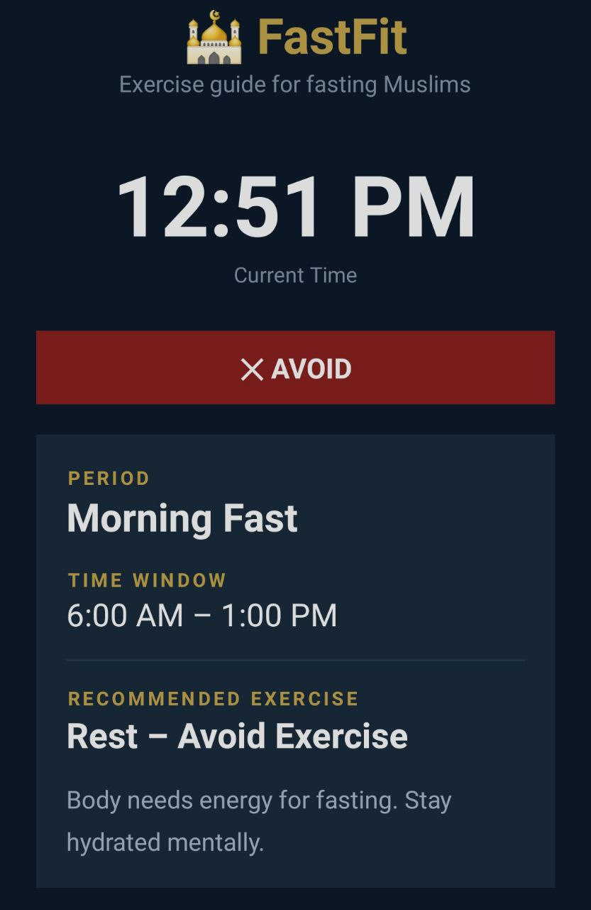

# FastFit 🕌 – Exercise Guide for Fasting Muslims
Simple Android app (Java) that shows the **best time to work out** based on
the current clock time during Ramadan.

---

## Screenshots

|                Profile Setup                 |                 Time Display – Top                 |            Time Display – Bottom             |
|:--------------------------------------------:|:--------------------------------------------------:|:--------------------------------------------:|
|        |           |  |
| *Enter age, weight, height, sex & time zone* | *Current time, status badge & recommendation card* |       *Full daily schedule reference*        |

> 📁 Place your screenshots in a `screenshots/` folder at the root of the project.

---

## Developed By

| Developer | Role |
|-----------|------|
| **Nawfel Berbague** | Android Developer |
| **Yaakoub Bouacha** | Android Developer |

---

## Project Structure

```
app/
├── java/com/example/fastfit/
│   ├── ExerciseSlot.java      ← Data model (time window + exercise info)
│   ├── UserProfile.java       ← User data (age, weight, height, sex, timezone)
│   ├── ProfileActivity.java   ← Profile setup screen
│   └── MainActivity.java      ← All logic (time detection, UI update)
│
└── res/layout/
    ├── activity_profile.xml   ← Profile entry screen
    └── activity_main.xml      ← Main screen (recommendation + schedule)
```

---

## How It Works

```
First Launch
     │
     ▼
ProfileActivity  ←── user enters age, weight, height, sex, time zone
     │
     ▼
UserProfile  →  fitnessTier()  (LIGHT / MODERATE / STANDARD)
     │
     ▼
Current Time (user's time zone)
     │
     ▼
findSlot()   ←── compares hour:minute against slot boundaries
     │
     ▼
ExerciseSlot  (period, timeRange, exerciseType, tip, status)
  personalised to fitness tier
     │
     ▼
UI updated   (badge colour = GREEN / OLIVE / RED based on status)
```

Auto-refreshes every **60 seconds** so the recommendation stays live.

---

## Daily Schedule (default)

| Time Window        | Period            | Exercise              | Status  |
|--------------------|-------------------|-----------------------|---------|
| 3:00 – 4:00 AM     | Pre-Suhoor        | Yoga / Stretching     | GOOD    |
| 4:00 – 6:00 AM     | Suhoor → Fajr     | Brisk Walk            | GOOD    |
| 6:00 AM – 1:00 PM  | Morning Fast      | Rest                  | AVOID   |
| 1:00 – 4:00 PM     | Afternoon Fast    | Rest                  | AVOID   |
| 4:00 – 5:30 PM     | Late Afternoon    | Light Stretching      | GOOD    |
| 5:30 – 6:30 PM     | Near Iftar        | Rest                  | AVOID   |
| 6:30 – 7:30 PM     | Just After Iftar  | Slow Walk             | GOOD    |
| 7:30 – 9:00 PM     | After Iftar       | Running / Cardio      | BEST ✦  |
| 9:00 – 11:00 PM    | Evening           | Strength / HIIT       | BEST ✦  |
| 11:00 PM – 3:00 AM | Late Night        | Yoga / Stretching     | GOOD    |

> Exercise type and intensity are personalised based on the user's age and BMI (fitness tier).

---